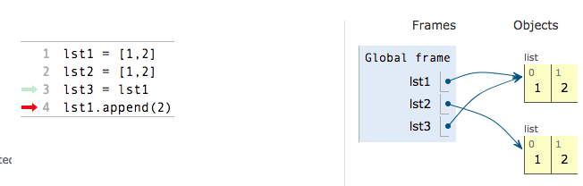
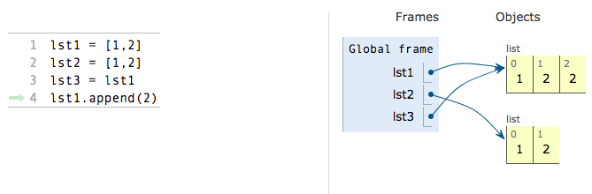

# Equal Lists

Earlier in this book, we talked about certain types. These types are called primitives and include integers, characters, booleans, and strings. However, lists are part of a different type- Objects. We will go over Objects in more depth in the next chapter but for now we will just discuss this in terms of lists.

Two variables whose values are lists are said to be equal if they ”point” to the same list. By this I mean that two variables are equal if they both point to the same container \(thinking of lists as containers for values\).

Even if two lists have the exact same values, it does not necessarily mean that the lists are equal. This can be visualized [in the following example](http://pythontutor.com/visualize.html#mode=display). Note how lst1 and lst2 are not pointing to the same list even though they have the same values at first \(1 and 2\). On the other hand, lst1 and lst3 point to the same values container because lst3 was set equal to the container that lst1 was pointing to.

Also note how after the append, the values in the lists lst1 and lst3 change because they point to the same container.

