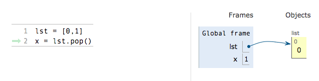
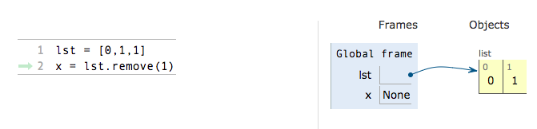

# Removing From Lists

Removing from a list is a bit more straightforward. We will go over two ways to remove from a list. The first one involves the pop syntax. The pop function has an optional index argument in which the user can input the index that they want to be removed. If no argument is specified, the last element is removed. The return value is the element that is removed.

Note how when we pop the original list is affected.

We will now use the remove syntax. The remove function takes in the value element that you want to remove and removes the first instance of it.

The original list is affected and the first instance of the number one is removed.

