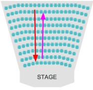

# A Quick Side Note on Recursion

The idea of Recursion can frequently be a bit hard to grasp so here will be a bit more of an intuitive explanation rather than a code based one.

Say that you are in a theater and it’s really dark and you want to know how many rows are in front of you but you can only see 1 row in front of you. How can you figure out how many rows are in front of you?

Well you can ask the person in front of you how many rows are in front of them and they can ask the person in front of them how many people are in front of them and so forth. This process continues until the person in the 0th row \(the very front row\) is asked this question. The person in the very front row would respond with ”0” since there are 0 rows in front of them. The person behind them then gets that result and adds 1 to it, since there’s the 0th row person didn’t include themselves in the count, and then tells the person behind them the number. This process continues until we reach the original person.

Recursively this would look something like the following function

```text
def theater(x):
    if x is in the first row:
        return 0
    return 1+ theater(person in the next row)
```

In this case reaching a person in the first row is the **base case**. Asking the person in front of you how many people are in front of them is the **argument reduction**. Adding up 1 at each argument is the **recursive step**.

Visually this looks like this. We go all the way down to the front of the theater then each person tells the person behind them how many people are in front of them.




