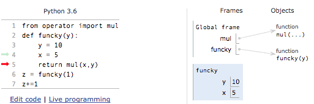

# Frames and Environment Diagrams

We earlier said that variables had some stored value. But to keep track of all these variables and functions, we need to store them within some structure. We will call an environment a place in a computer’s memory where we store all this information. Environments consist of a series of frames, each frame refers to a new function call. More on this in a few.

So far, we have dealt with somewhat basic functions and calls. With many function calls and variables, it becomes imperative that we have some organized method of keeping account of them. We will be using a visualization called Environment Diagrams to keep track of bindings, the association of a name to some value. Frames will be represented as boxes with variables within them. This is all a bit complicated to write in words, so we will go through this with pictures. Take the following [function](https://goo.gl/oiraLu). The picture is one from [Pythontutor](http://pythontutor.com/), the website where we will display environment diagrams. The green arrow refers to a line that has executed and the red arrow refers to what will be executed at the next step.


We start off in what is called the **Global Frame**. The Global Frame is not that special from other frames other than the fact that assignment and import statements can only occur in the Global Frame. We start off in the first line in our Global Frame and assign mul to the pre-define function ”mul”. In the next line we define a‘ user defined function, funcky. We assign a value of the function funcky to the name ”funcky”. We do not actually evaluate the function yet because we have not reached a line where we have a function call to funcky. Note how on the ”Objects” side of our image, the user-define function funcky has a parameter y wheras for our in-built function, mul, we have some ”...” in parentheses. The reason for this is that the function funcky can only take in 1 value whereas the mul function can take in an arbitrary amount of arguments.

Additionally, we have the idea of **Parent Frames**. Whenever a function is called, it has a parent. The parent frame is the frame in which the function is defined. In this case, funcky’s parent is the Global Frame.This concept will come more into play in the next lesson.




To evaluate the call funcky\(1\), we will create a frame for this specific function call. The y value would start off as 1, as that is the value we initially pass in our actual function call. However, in the first step of funcky, y gets redefined to be 10. Following this, x gets defined to be 5.


We move onto line 5. There is a call to the function mul with arguments x and y. We look in the current frame and see that x is defined to be 5 and y is defined to be 10. We evaluate the function call, which results in the value of 50. The reason why we created a frame for the function funcky and not not the mul function is because mul is an in-built function whereas funcky is user defined. We can actually walk through what user defined functions do because we have knowledge on how they work; however, we have no clue how Python chooses to implement its in-built functions.


There is nothing more to do in this frame because we just returned, essentially exiting from the frame. We then return to the Global frame and set z equal to the value of the return value of funcky\(1\), which, as discovered earlier, is 50.

In the final line, we use a syntax that has not been seen yet. We have z+=1, the ”+=” essentially means that we will add whatever is on the right side to the item on the left side. Or in terms that may be easier to understand:

```text
z=z+1
```

Since z was originally 50, we add 1 to it getting 51. Following this, we reassign z to be equal to 51.

We will not usually go this indepth for environment diagrams; however, we feel that it was useful to go through it for this one example to get the basic idea of how they work. Whenever referring to a snippet of code in an environment diagram, we will provide a link in blue so you can work with the code interactively.

