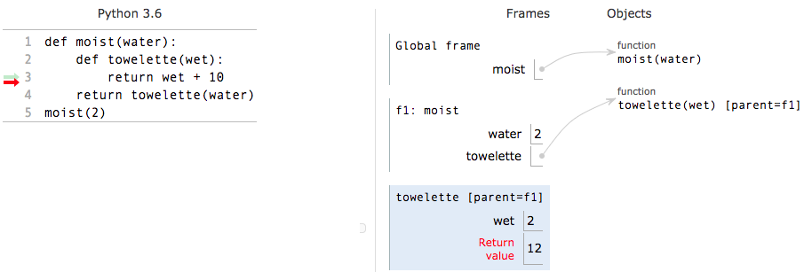

# Nested Functions

Prior to this section, when we dealt with nested expressions they were just nested function calls in the following manner: func1\(func2\(....\)\). This is okay for certain cases but there are some draw backs. One of the main reasons we may want to use a nested function is because sometimes we want to only allow a function run for another function. In our old way of having nested expressions, we would need to have all the functions available to everyone.

Below is an example of a nested function:

```text
def moist(water):
    def towelette (wet ):
        return wet + 10
    return towelette(water)
```

We have a function moist that takes in a parameter water. Inside the function moist there is another function towelette which takes in a variable water. Say we were to run the following line of code:

```text
moist(2)
```

What would we get as a return value to this function? Well it can get a bit weird because we would return

a function call when we run moist\(2\) so let’s walk through this example to avoid any confusion \([link to PythonTutor](http://pythontutor.com/visualize.html#code=def%20moist%28water%29%3A%0A%20%20%20%20def%20towelette%20%28wet%20%29%3A%0A%20%20%20%20%20%20%20%20return%20wet%20%2B%2010%0A%20%20%20%20return%20towelette%28water%29%0Amoist%282%29&cumulative=false&curInstr=0&heapPrimitives=nevernest&mode=display&origin=opt-frontend.js&py=3&rawInputLstJSON=%5B%5D&textReferences=false)\):


We start by doing a normal function call to moist\(2\). The parameter water is set to 2.


Now we get into the more interesting part. We now go to the return statement in moist and return towelette water. Now going back to our earlier rules, since we are returning a function call and not a function, we evaluate this statement further. we know that we evaluate this function before finally returning a value so let’s go a bit further!



We go into the function towelette with wet assigned to 2. We then return wet + 10 which is 12, making the return value for this frame equal to 12.


We have returned out of the frame for towelette, but we aren’t done yet! Remember, that return value was for a function call that itself was in a return statement! So we return out of the frame for the function moist with a value equal to the return value of towelette\(water\), or 12.

When drawing out the function calls for nested functions remember to keep your environment diagrams a

bit clean, and to label the parents of frames, otherwise things cant get a bit crazy.

