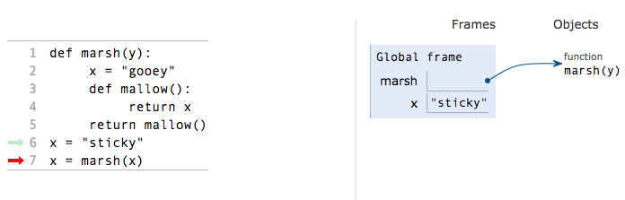
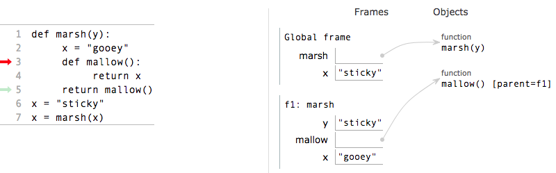
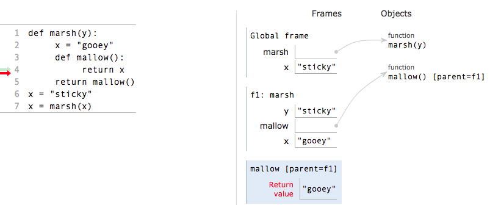
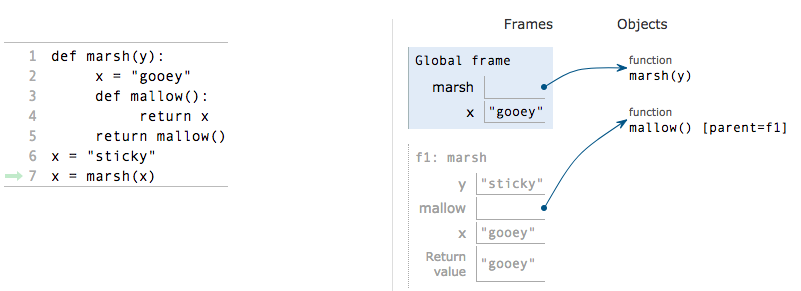

# Scope of Variables

Now that we know what frames are, there comes an interesting question. Can we access all variables from anywhere in the program? The answer is no! These frames designate a sort of hierarchy and we will go over them in this section. An important concept for scopes is the idea of Parent Frames. Just as a review, a frame’s parent is the frame that the function was defined in.

1. Parent frames cannot make direct references to variables in child frames. This makes intuitive sense. You cannot be sure that a function call would occur, as a result, you have no knowledge on if a frame executed or not.
2. Child frames can view variables in parent frames; however, they cannot directly edit those values. There will be exceptions to this which we will go on later.

It is important to note that since functions are essentially variables- just a name defined to some set of operations, these same rules also apply to functions.

We will over a basic example now showing some of the ways the scope of variables can be made a bit tricky.

```text
def marsh(y):
    x = ”gooey”
    def mallow():
        return x
    return mallow () 
x = ”sticky”
x = marsh(x)
```

Now there sure are a lot of ”x”’s on here so it can be a bit confusing to see which x goes where. So let’s do this step by step.



We start off with x equal to the string ”sticky”. We then set x equal to the value of marsh\(x\). However, we have not yet found the value for this yet, so we will first evaluate the function call marsh\(x\) where x is the string ”sticky”.



Now we go into function marsh and the parameter y is set to the passed in value, which was ”sticky”, or x in the global frame. Then the x value in this frame is set equal to gooey. After this statement, we have the line that returns mallow\(\). We must now evaluate the function call for mallow\(\).



We go into mallow and then we have a new dilemma- we are returning x; however, there is no x in this frame. Well according to our rules, we can view the values in our parent frames, but we cannot modify them. Since we are not redefining x, we can get the value of x from our parent frame, in this case f1, or our call to mash\(x\). The value of x in this frame is the string ”gooey”, so we return ”gooey”.



We then return mallow\(\) in f1 which is equal to ”gooey”. After this, we finally have the value of marsh\(x\)- ”gooey”. At this point we redefine x to be equal to ”gooey” in the global frame.

